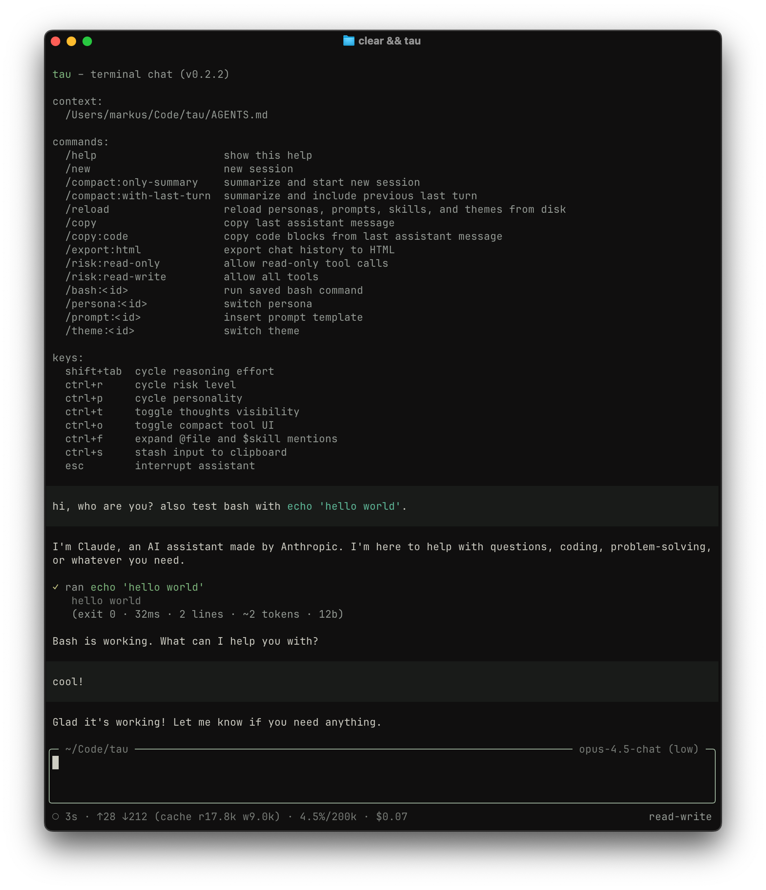

# tau

a terminal-based AI chat client for working with code. tau gives you access to Claude, GPT, and Gemini models, each equipped with tools to explore, write, and edit files in your project, plus optional sub-agents for deeper codebase investigation and web research.



## installation

```sh
npm install -g @markusylisiurunen/tau@latest
```

you'll need an API key from at least one provider. set it via environment variable:

```sh
export ANTHROPIC_API_KEY=sk-ant-...
# or OPENAI_API_KEY, or GOOGLE_API_KEY
```

or store keys in `~/.config/tau/config.json`:

```json
{
  "apiKeys": {
    "anthropic": "sk-ant-...",
    "openai": "sk-...",
    "google": "...",
    "parallel": "..."
  }
}
```

environment variables take precedence over the config file.

`parallel` is only needed for the web sub-agent tools (`web_search`/`web_fetch`).

## security notice

**the risk level system is a UX guardrail, not a hard security boundary.** it helps prevent accidental writes and guides model behavior, but it has significant limitations:

- **model trust**: the bash tool relies on the model honestly declaring whether a command is a read or write. there's no runtime validation that the command actually matches the declared intent. a model could declare `safetyLevel="read"` while running `rm -rf /`.
- **no command analysis**: the system doesn't inspect command content. it trusts the declared safety level without verifying what the command actually does.
- **full system access**: there is no sandboxing or directory restriction. the model can access any file on your system that your user account can read or write, not just the current working directory.
- **user bypasses**: the `!` prefix executes shell commands directly, completely bypassing risk level checks. this is intentional for interactive use, but means risk levels only constrain the model, not the user.

note that there is no confirmation step before tool execution. the model runs commands immediately, and you can only observe the results after the fact.

## getting started

tau requires Node.js 20+ and runs on macOS.

for development from source:

```sh
npm install
npm run build
npm start
```

or run directly via tsx:

```sh
npm run dev
```

## risk levels

tau uses risk levels to control what the model can do. this lets you stay in control while working alongside AI.

- **none**: model can only chat, no tools available
- **read-only** (default): model can explore your codebase but can't modify anything
- **read-write**: model can create, edit, and delete files

start with a specific risk level:

```sh
tau --risk read-write
```

or change it during a session with `/risk:read-only` or `/risk:read-write`.

the default is read-only because it lets the model investigate your code and answer questions without risk of unintended changes. bump it to read-write when you're ready to let the model make edits.

## personas

tau comes with several built-in personas across different models:

- **Claude Opus 4.5** and **Haiku 4.5** (Anthropic)
- **GPT-5.2** (OpenAI)
- **Gemini 3 Pro** and **Gemini 2.5 Flash** (Google)

each model has three variants: a general-purpose assistant, a coder variant optimized for software engineering, and a raw variant with minimal prompting. basic and coder variants include the `web` sub-agent for web research, and coder variants also include the `explore` sub-agent for multi-turn codebase investigation.

switch personas at startup with `--persona` or mid-session with `/persona:<id>`:

```sh
tau --persona opus-4.5-coder
```

## sub-agents

some personas can run isolated sub-agents via the internal `task` tool:

- `explore`: read-only, multi-turn codebase investigation
- `web`: high-threshold web research using Parallel Search/Extract (`web_search`/`web_fetch`)

to use the web sub-agent, set `apiKeys.parallel` in `~/.config/tau/config.json` (see above). tau will only make web calls when needed or when you explicitly ask for web research.

## reasoning

some models support extended thinking, where they reason through problems before responding. cycle through reasoning levels with `shift+tab`, or set one at startup:

```sh
tau --persona opus-4.5:high
```

toggle visibility of the model's thinking with `ctrl+t`.

## working with files

reference files in your message by typing `@` followed by the filename. autocomplete helps you find the right path. press `ctrl+f` to expand file contents into the conversation, letting the model see the actual code.

you can also pipe content directly:

```sh
cat src/app.ts | tau --persona opus-4.5
```

for project-aware sessions, use `--with-context` to inject your AGENTS.md (or similar project guidelines file) into the system prompt. run `tau --help` to see all available options.

## memory mode

prefix a message with `#` to update your project's AGENTS.md file. this is useful for capturing decisions, conventions, and context as you work.

```
# prefer explicit error messages with context about what operation failed
```

tau will create or update AGENTS.md at your project root, integrating the new information into the existing structure. over time, this builds a knowledge base about your project. combine it with `--with-context` so future sessions understand your conventions without re-explaining them.

## commands

tau supports slash commands for common actions:

| command                | description                                    |
| ---------------------- | ---------------------------------------------- |
| `/help`                | show available commands                        |
| `/new`                 | clear the session and start fresh              |
| `/copy`                | copy the last assistant message                |
| `/copy:code`           | copy just the code blocks                      |
| `/reload`              | reload personas, prompts, and skills from disk |
| `/fork:only-summary`   | compress history and continue with a summary   |
| `/fork:with-last-turn` | compress history but keep the last exchange    |
| `/persona:<id>`        | switch to a different persona                  |
| `/prompt:<id>`         | insert a saved prompt template                 |
| `/bash:<id>`           | run a saved shell command                      |
| `/risk:<level>`        | change the risk level                          |
| `!<cmd>`               | run a shell command directly                   |

the fork commands are useful when conversations get long. they compress everything into a summary so the model retains context without the overhead of a full history.

## keyboard shortcuts

| key         | action                      |
| ----------- | --------------------------- |
| `shift+tab` | cycle reasoning effort      |
| `ctrl+t`    | toggle thinking visibility  |
| `ctrl+o`    | toggle compact tool display |
| `ctrl+f`    | expand @file mentions       |
| `esc`       | interrupt generation        |
| `ctrl+c`    | exit                        |

## configuration

### global config

store settings in `~/.config/tau/config.json`:

```json
{
  "apiKeys": {
    "anthropic": "sk-ant-...",
    "openai": "sk-...",
    "google": "...",
    "parallel": "..."
  },
  "defaultPersona": "gpt-5.2",
  "defaultRisk": "read-write",
  "toolDisplayMode": "compact",
  "userPreferences": "prefer concise responses. use TypeScript for examples."
}
```

the `defaultPersona` field specifies which persona to use when starting the app. the `--persona` flag overrides this setting.

the `defaultRisk` field sets the initial risk level (`none`, `read-only`, or `read-write`). the `--risk` flag overrides this setting. if not specified, defaults to `read-only`.

the `userPreferences` field lets you set guidance that applies to every conversation: preferred languages, response style, or domain context.

`toolDisplayMode` controls how tool calls appear: `"compact"` (default) shows one-line summaries, `"full"` shows detailed blocks.

### project bash commands

define shortcuts for common shell commands in `.tau/config.json` at your project root (or `~/.tau/config.json` globally):

```json
{
  "bash": [
    { "id": "check", "description": "lint + typecheck", "cmd": "npm run check" },
    { "id": "test", "cmd": "npm test" }
  ]
}
```

run them with `/bash:check` or `/bash:test`.

### custom personas

create your own personas by adding markdown files to `~/.config/tau/personas/` (user-level) or `.tau/personas/` (project-level):

```markdown
---
id: my-assistant
provider: anthropic
model: claude-opus-4-5
---

you are a helpful assistant specialized in my workflow.
focus on clarity and efficiency.
```

the frontmatter defines the persona's id, provider, and model. the markdown body becomes the system prompt.

you can also set model parameters via optional frontmatter fields:

- `reasoning`: one of `none`, `minimal`, `low`, `medium`, `high`, `xhigh`
- `allowedReasoningLevels`: list of reasoning levels shown in the ui
- `skills`: list of enabled skill names (matched by `name` in skill frontmatter), or `"*"` to enable all discovered skills
- `subagents`: enable sub-agents (`explore` for multi-turn codebase investigation, `web` for web research). you can specify as a list (`subagents: [explore]`, `subagents: [web]`, or `subagents: [explore, web]`) to use the main persona's model, or as an object to customize each sub-agent's model and reasoning. example:
  ```yaml
  subagents:
    explore:
      provider: anthropic
      model: claude-haiku-4-5
      reasoning: medium
  ```

use it with `--persona my-assistant` or `/persona:my-assistant`. if a project persona id conflicts with a user or built-in persona, the project persona wins.

### custom prompts

save reusable prompt templates in `~/.config/tau/prompts/` (user-level) or `.tau/prompts/` (project-level):

```markdown
---
id: review
---

review this code for bugs, edge cases, and style issues.
suggest specific improvements with code examples.
```

insert them with `/prompt:review`. if a project prompt id conflicts with a user or built-in prompt, the project prompt wins.

### skills

skills are optional markdown files discovered at `~/.config/tau/skills/<dir>/SKILL.md` (user-level) and `.tau/skills/<dir>/SKILL.md` (project-level). each `SKILL.md` must contain yaml frontmatter with `name` and `description`.

enable skills per persona with the `skills` frontmatter field. you can list specific skill names (matched by `name` in skill frontmatter), or use `"*"` to enable all discovered skills. all non-raw built-in personas (basic and coder variants) have `skills: "*"` by default. tau injects an index of enabled skills into the system prompt containing only each skill's `name`, `description`, and absolute file path.

use `/reload` to pick up changes to personas, prompts, and skills without restarting.

## how it works

tau connects your terminal to large language models, giving them tools to interact with your filesystem. when you ask the model to explore code or make changes, it decides which tools to use and executes them with your permission (based on risk level).

the model sees your messages, any file contents you've shared, and the results of tool calls. it doesn't have ambient access to your filesystem; it only sees what you show it or what it explicitly requests through tools.

tool calls are displayed in the UI so you can see exactly what the model is doing. use `ctrl+o` to toggle between compact and detailed views.

## creating a release

publishing to npm happens automatically via github actions when a github release is published.

release steps:

- run checks and build:

```sh
npm run check
npm run build
```

- bump the version (creates a git tag):

```sh
npm version patch
```

- push the commit and tag:

```sh
git push --follow-tags
```

- create a github release (this triggers the publish workflow):

```sh
gh release create v$(node -p "require('./package.json').version") --generate-notes
```
